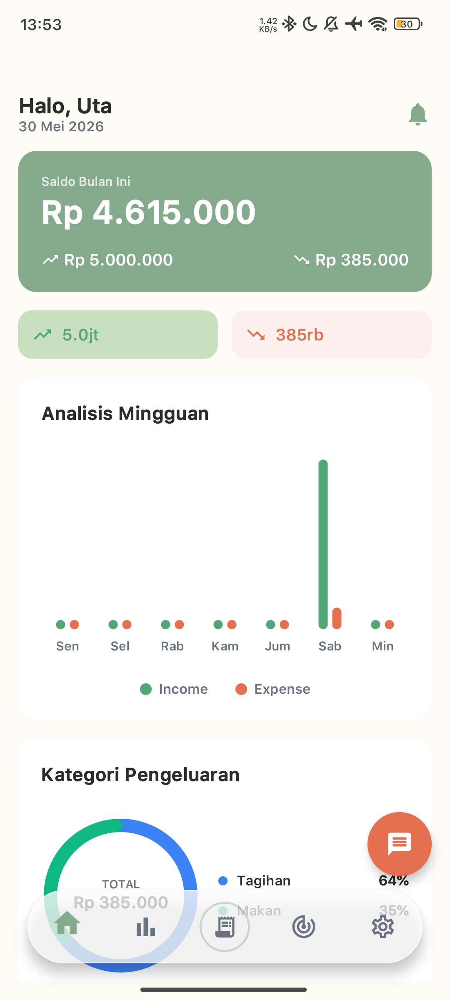
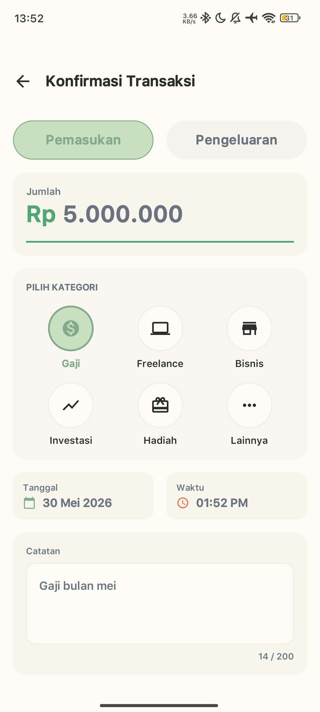
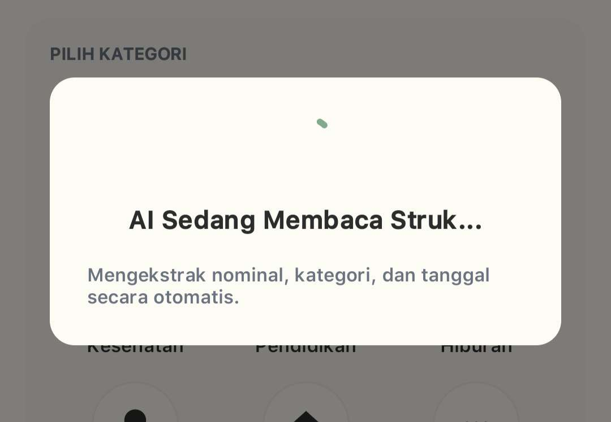
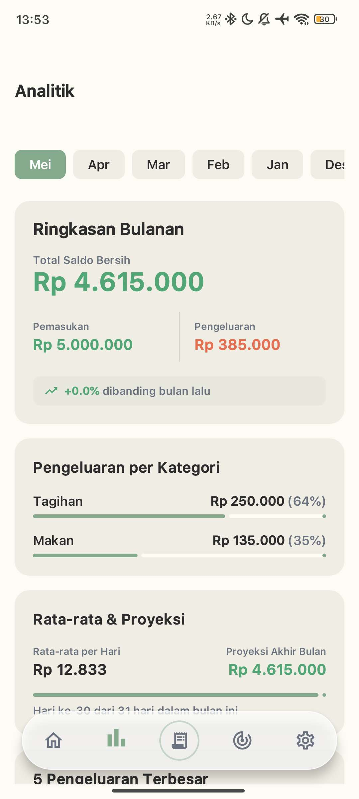
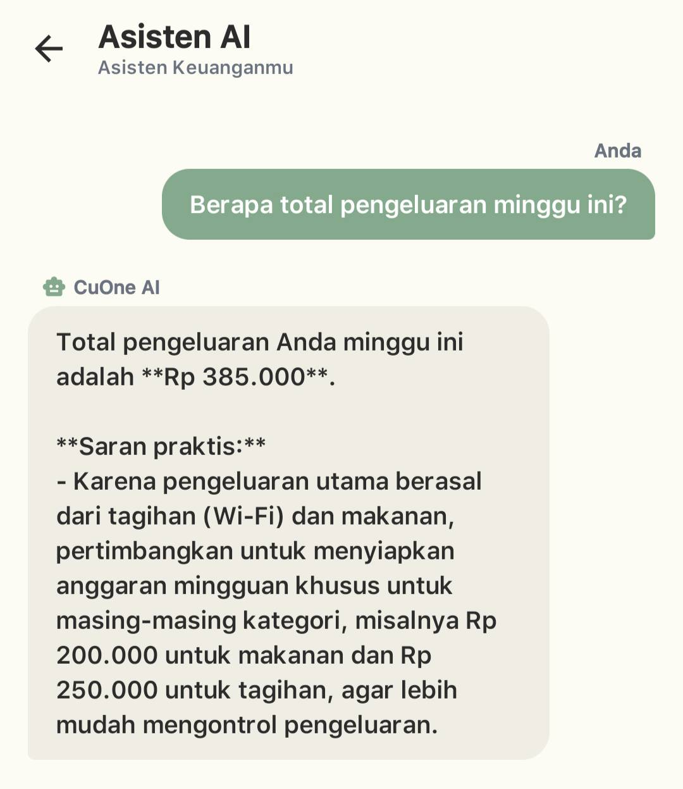
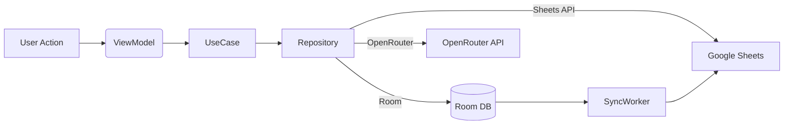

# CuOne — Cuan: Pencatatan Keuangan Cerdas

<p align="center">
	
</p>

Sebuah aplikasi Android berbasis Kotlin + Jetpack Compose yang memudahkan pencatatan transaksi, analitik keuangan, dan integrasi Google Sheets tanpa backend pusat. Dirancang untuk menjaga kedaulatan data pengguna, mendukung pencatatan manual, pemindaian struk (OCR + AI), dan chat asisten keuangan berbasis model OpenRouter.

## Ringkasan Singkat

- Platform: Android (min SDK 26)
- Bahasa: Kotlin
- UI: Jetpack Compose (Material 3)
- Arsitektur: Clean Architecture (Presentation / Domain / Data)
- Penyimpanan utama: Google Sheets (user-owned) — tidak ada database server milik aplikasi; Room hanya digunakan sebagai antrean offline pada perangkat
- AI: OpenRouter (model LLM untuk parsing & chat) + ML Kit OCR untuk ekstraksi teks dari gambar

## Fitur Utama

- Onboarding cepat dengan input nama pengguna.
- Pencatatan transaksi manual, dari hasil scan struk/QRIS, dan dari teks bebas (free-text).
- Integrasi dua-arah dengan Google Sheets: tab per bulan + ringkasan otomatis.
- Anomali detection: deteksi pengeluaran tidak wajar dan pemberitahuan rekomendasi.
- Analitik: ringkasan bulanan, breakdown kategori, tren 6 bulan, top 5 pengeluaran.
- Target tabungan dengan kalkulasi harian/ mingguan yang diperlukan.
- Asisten AI chat yang dapat menjawab pertanyaan keuangan berbasis data pengguna.
- Sinkronisasi offline-first: Room queue + WorkManager untuk push ke Sheets saat online.
- Export/Share ringkasan visual (bitmap) untuk dibagikan ke aplikasi lain.

## Tampilan Aplikasi

Berikut beberapa tampilan utama aplikasi CuOne.

<p align="center">
	
</p>

<p align="center"><em>Beranda utama yang menampilkan saldo, ringkasan cepat, analitik mingguan, dan akses fitur inti.</em></p>

<table>
	<tr>
		<td align="center" width="50%">
			
			<br />
			<strong>Transaksi</strong>
			<br />
			<sub>Form konfirmasi transaksi dengan kategori, nominal, tanggal, dan catatan.</sub>
		</td>
		<td align="center" width="50%">
			
			<br />
			<strong>Scan Struk</strong>
			<br />
			<sub>Proses pembacaan struk berbasis OCR dan AI untuk ekstraksi otomatis.</sub>
		</td>
	</tr>
	<tr>
		<td align="center" width="50%">
			
			<br />
			<strong>Analitik</strong>
			<br />
			<sub>Ringkasan keuangan bulanan, kategori pengeluaran, dan tren mingguan.</sub>
		</td>
		<td align="center" width="50%">
			
			<br />
			<strong>AI Chat</strong>
			<br />
			<sub>Asisten finansial untuk menjawab pertanyaan dan memberi saran praktis.</sub>
		</td>
	</tr>
</table>

## Arsitektur & Alur Kerja (ringkas)

1. UI (Compose) → 2. ViewModel (StateFlow / UiState) → 3. UseCase (Domain) → 4. Repository → 5. DataSource (Sheets API / Room / OpenRouter)

Merupakan pola Clean Architecture; UI tidak mengakses data layer langsung. Sinkronisasi transaksi mengikuti alur:

- User menambah transaksi (manual / scan / free-text)
- Simpan lokal di Room (isSynced = false)
- WorkManager / SyncWorker mencoba append baris ke tab bulan yang sesuai di Google Sheets
- Jika sukses: update isSynced = true, update ringkasan



## Struktur Proyek (intinya)

- `app/` — modul Android utama (kode sumber, resources, manifest)
- `app/src/main/java/com/cuan/` — package utama, berisi layer `core`, `data`, `domain`, `feature`, dan `ui`
- `AGENTS.md` — panduan agen AI dan spesifikasi desain sistem (komprehensif)
- `build.gradle.kts`, `settings.gradle.kts`, `gradle.properties` — konfigurasi build

Contoh partial tree:

```
app/
	├─ src/main/java/com/cuan/
	│   ├─ core/        # network, datastore, di, utils
	│   ├─ data/        # repository impl, mappers, models
	│   ├─ domain/      # use cases
	│   └─ feature/     # screens per fitur (dashboard, transaction, scan, ai_chat)
	└─ build.gradle.kts
```

## Integrasi & Komponen Eksternal

- Google Sheets API: menyimpan transaksi di spreadsheet milik pengguna; membuat tab per bulan; ringkasan otomatis.
- OpenRouter API: memproses parsing teks/struk dan menyajikan asisten chat.
- ML Kit Text Recognition: ekstraksi OCR dari foto struk / screenshot.
- Room: antrean offline untuk transaksi yang belum tersinkron.
- WorkManager: penjadwalan sinkronisasi dan pengingat harian.

## Data Model Ringkas

- Transaction: id, amount (Rp), type (INCOME/EXPENSE), category, note, date, timeMillis, source, isSynced, rawSheetsRowIndex
- UserProfile: name, occupation, incomeRange, sheetsUrl, openRouterApiKey, isProfileComplete

## Panduan Pengembangan (singkat)

1. Persyaratan: JDK 17+, Android SDK sesuai compileSdk di `app/build.gradle.kts`.
2. Konfigurasi lokal: isi `local.properties` (Android SDK path) dan masukkan credential yang diperlukan melalui UI (Google Sign-In & OpenRouter API key) — jangan hardcode API key.
3. Build & jalankan pada device/emulator:

```powershell
./gradlew assembleDebug
./gradlew installDebug
```

4. Untuk bekerja dengan Google Sheets: lakukan Google Sign-In dari aplikasi dan pilih spreadsheet (aplikasi menyimpan ID spreadsheet di DataStore).

## Cara Kerja Fitur Scan & Parse

- Foto struk → ML Kit OCR → hasil teks → dikirim ke OpenRouter dengan prompt parser khusus → OpenRouter mengembalikan JSON terstruktur (amount, type, merchant, category, date, note) → tampilkan ke user untuk konfirmasi → simpan.

Jika parsing gagal, fallback ke form manual.

## Testing & Debugging

- Unit test: letakkan di `app/src/test/java/` untuk use-case dan utilitas.
- Instrumentation/UI test: `app/src/androidTest/java/`.
- Logs: network & AI calls dilengkapi interceptor OkHttp (aktifkan logging pada debug build).

## Contribusi

- Ikuti pola coding di `AGENTS.md` (naming, struktur, design system).
- Buka issue / Pull Request dengan deskripsi fitur dan langkah reproduksi.

## Catatan Keamanan & Privasi

- Proyek ini **tidak** menyimpan data keuangan pengguna di database server milik pengembang atau pihak ketiga. Semua data transaksi disimpan langsung di Google Spreadsheet yang dimiliki dan dikontrol oleh pengguna.
- `Room` hanya digunakan sebagai antrean lokal sementara (offline queue) di perangkat untuk memastikan pengalaman offline-first; antrean ini tidak menjadi database pusat dan hanya berfungsi untuk menyimpan sementara sebelum sinkronisasi ke Google Sheets.
- API key OpenRouter dan credential OAuth untuk Google disimpan hanya lokal di DataStore (encrypted) — tidak dikirim ke server pihak ketiga oleh aplikasi.
- Karena data utama berada di spreadsheet pengguna, pengguna memiliki kontrol penuh atas akses, berbagi, dan penghapusan data — ini meningkatkan privasi dibanding menyimpan data di server aplikasi.

## Kontak

Untuk pertanyaan teknis dan kontribusi lebih lanjut, buka issue di repository atau hubungi maintainer proyek:

- GitHub: [tsubametaa](https://github.com/tsubametaa) - Alvin Putra
- GitHub: [Rasen22](https://github.com/Rasen22) - Farhan Rasendriya

---

File utama yang relevan: [AGENTS.md](AGENTS.md), [app/build.gradle.kts](app/build.gradle.kts), [settings.gradle.kts](settings.gradle.kts)
